# Angular-Spring-Secured
Angular FrontEnd + Spring boot BackEnd + Authentication Security using Keycloak by MITA NABIL 5IIRG3-Centre

# Question 1: Micro-service customer-service
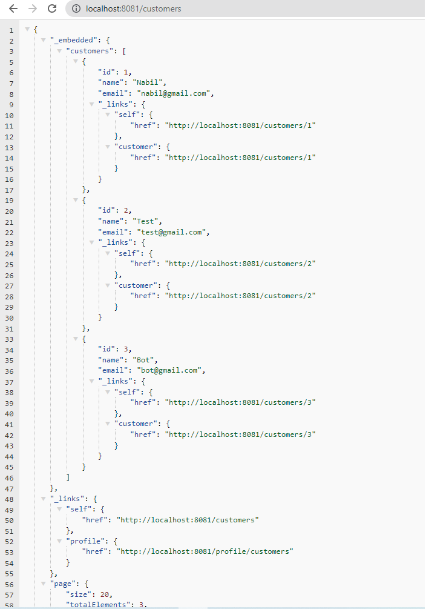

# Question 2: Micro-service inventory-service
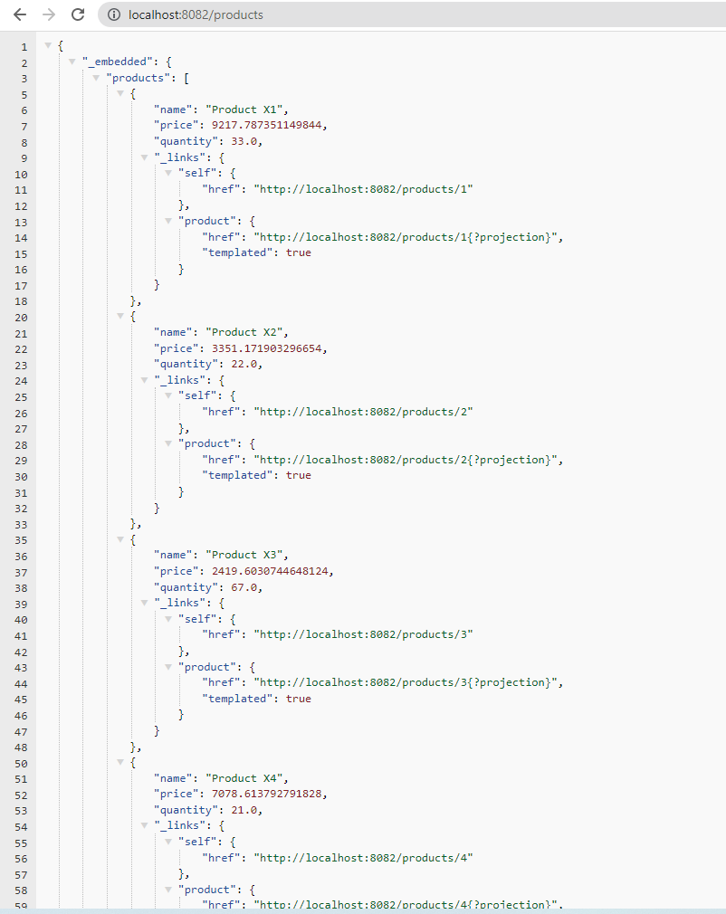

# Question 3: Configuration routage Statique avec Gateway Spring cloud Gateway
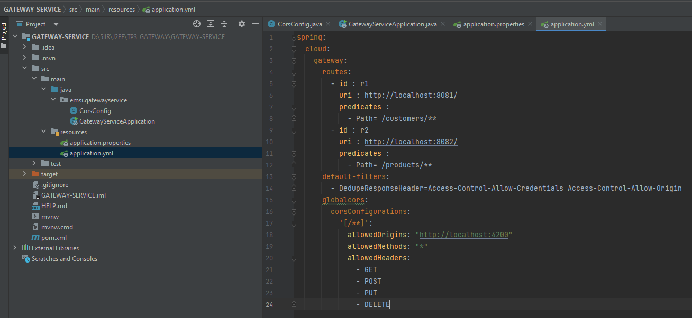

# Question 4: Annuaire Eureka Discrovery Service
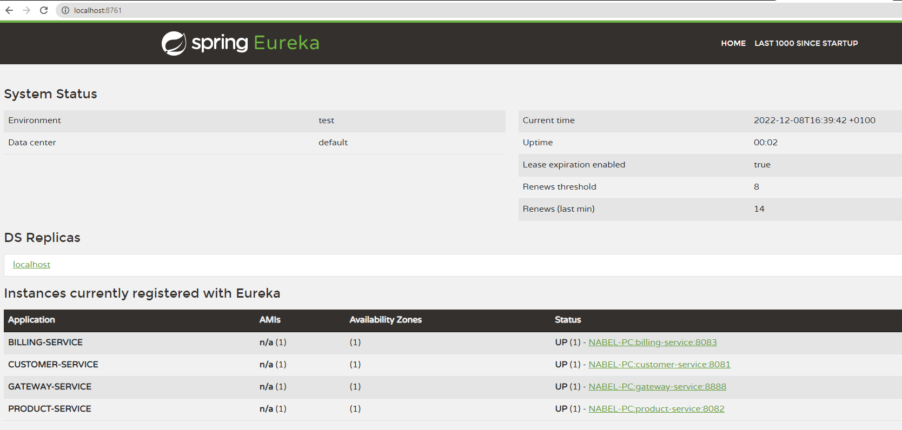

# Question 5: Configuration routage Dynamique
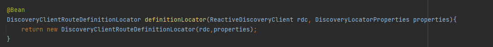

# Question 6: Micro-service billing-service avec Open Feign
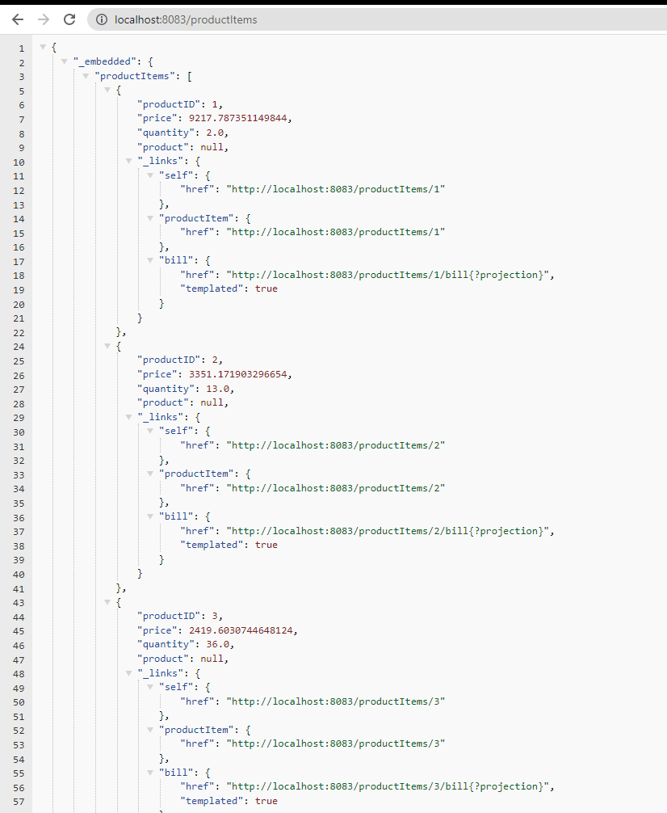
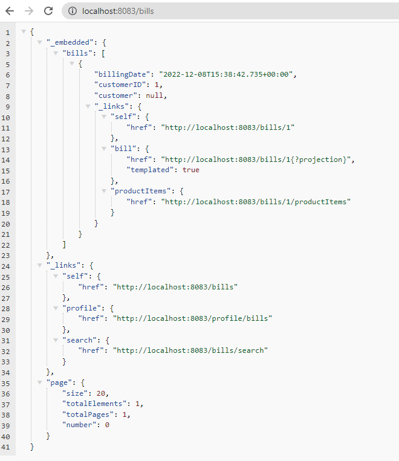

# Question 7: FrontEnd Angular
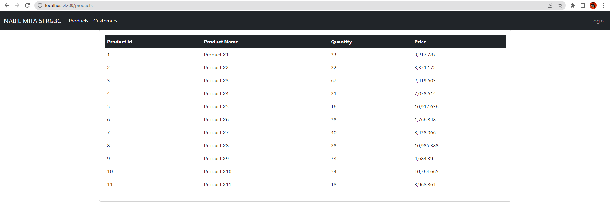
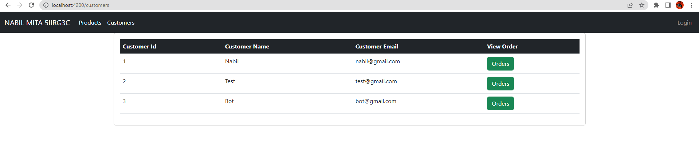
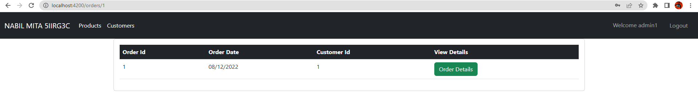
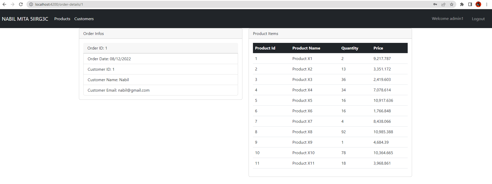
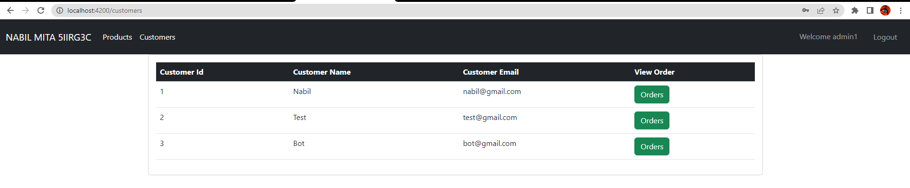

# Question 8: Serveur KeyCloak
## REALM

## Client
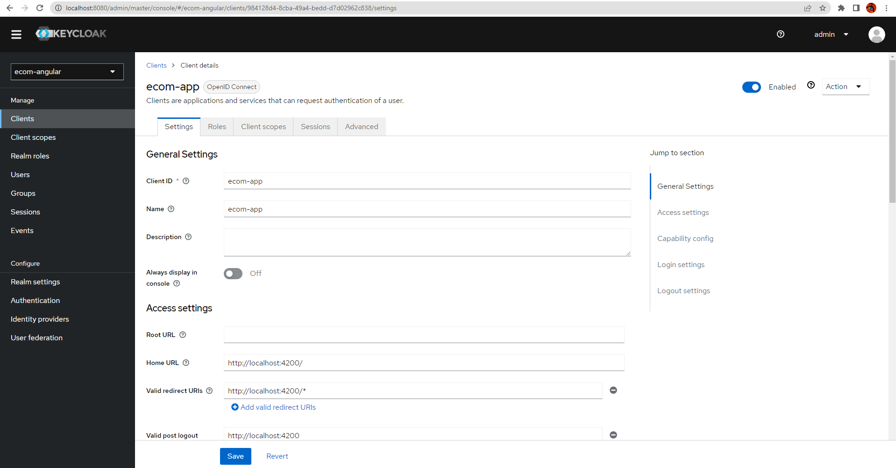

## Utilisateurs
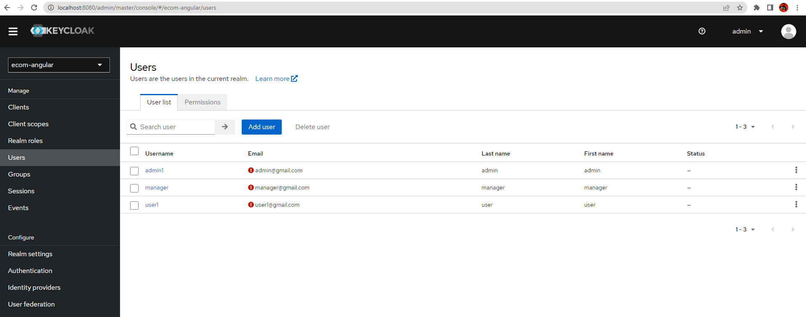

## Rôles
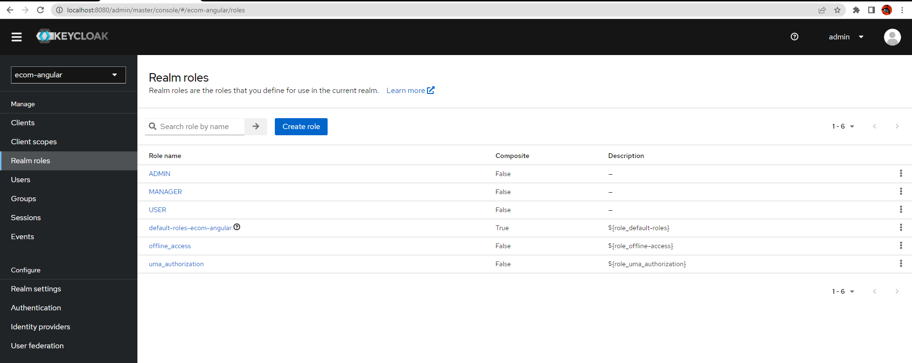

## Rôle Mapping
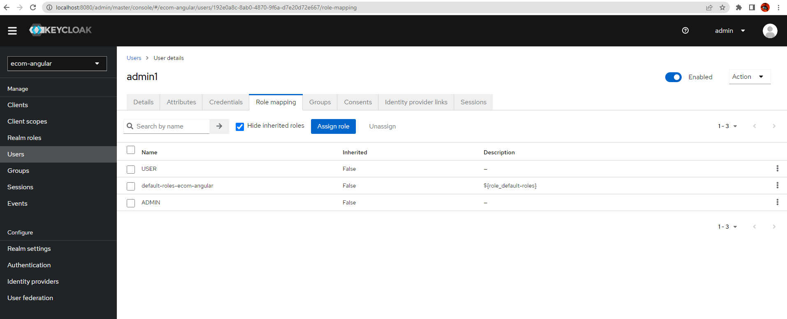

## Authentification Postman en utilisant username & password pour demander l'access-token
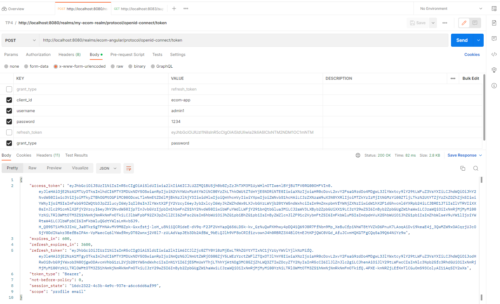
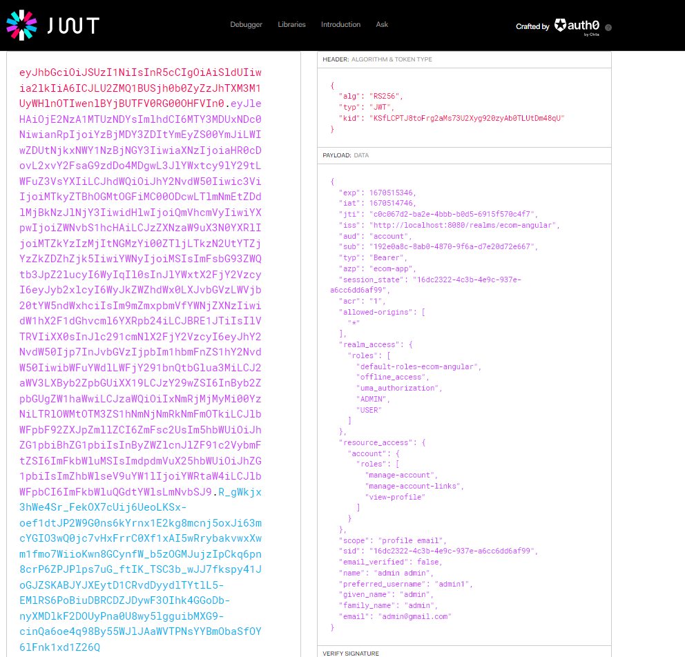

## Postman demande de refresh token
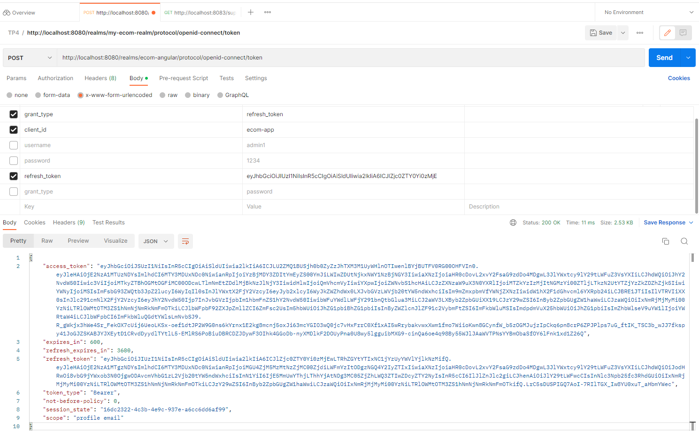
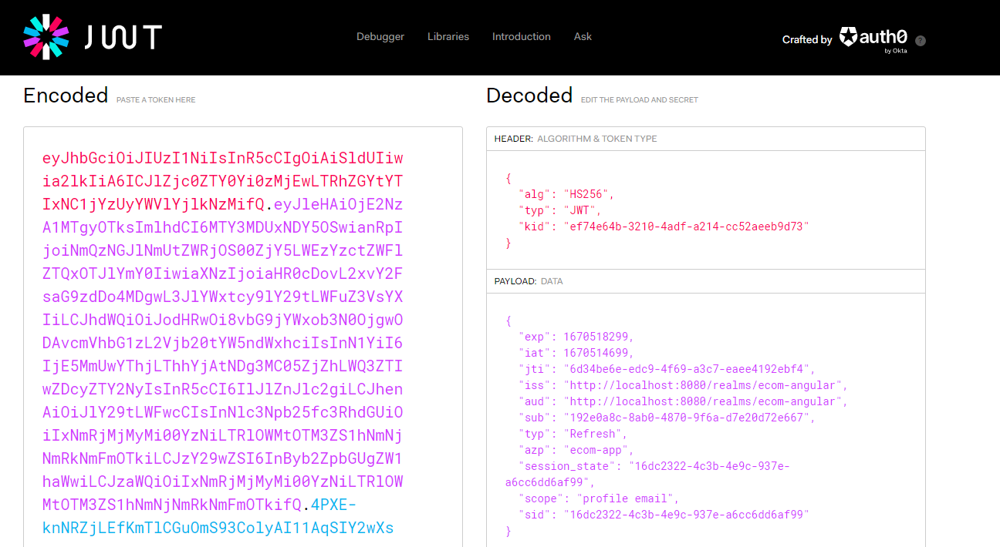

# Question 9: Sécurisation du frontend Angular (Components Orders & OrderDetails) avec KeyCloak 

# Question 10: Fonctionnalité Supplémentaire:
-- soon.
